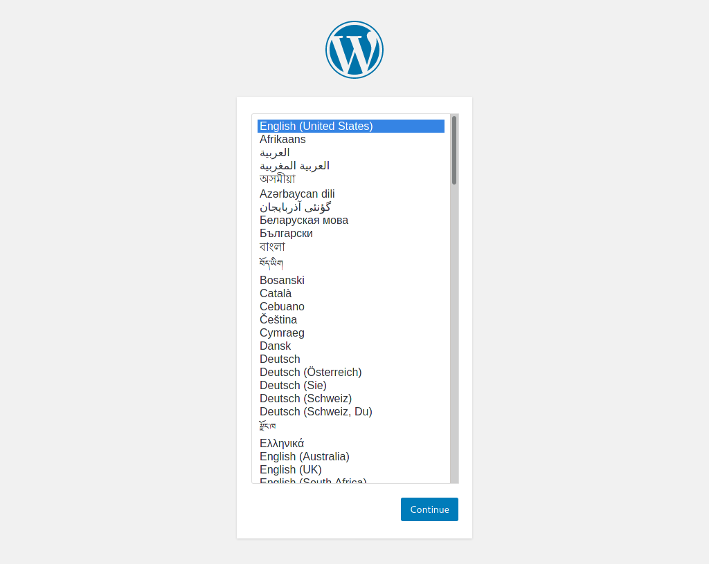

# Minimal WordPress MySQL Pod

No persistence. Just a playground.



## Run pod

```
podman play kube pod.yaml
```

## Play around with WordPress

[http://localhost:8080/](http://localhost:8080/)

## Remove pod

```
podman pod rm -f mwmp
```